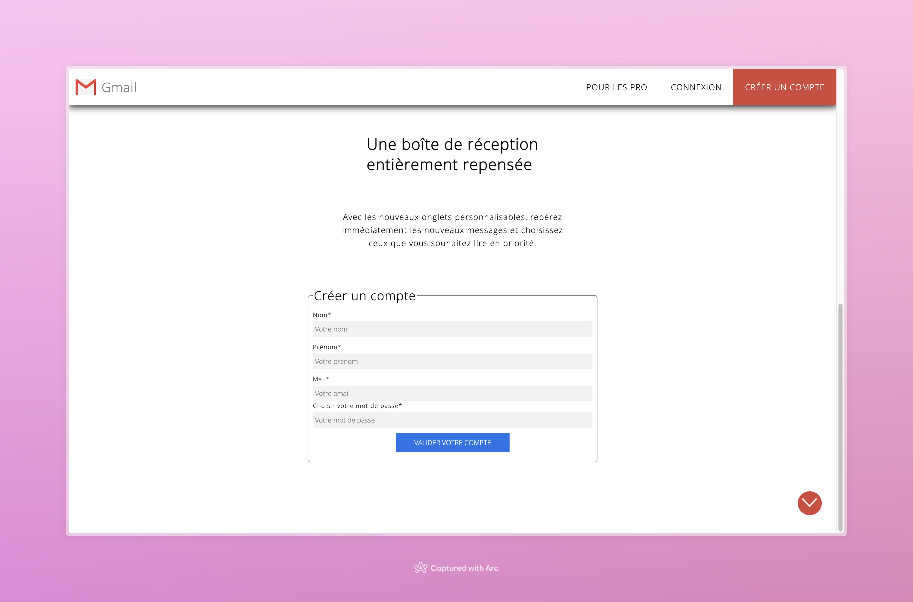

# [Gmail Project](https://lav000.github.io/GmailProject/)

## About
🇫🇷 Le projet Gmail est un projet scolaire qui a pour but de reproduire l'interface gmail de façon static et dynamique. Cette interface est relier a une bdd et permet de créer un compte et d'être autentifier grâce au compte crée. Elle réspect certaine norme de securité comme l'utilisation d'un token, le cryptage du mot de passe ainsi que la protéction du code des attack xss.

🇬🇧 The Gmail project is a school project which aims to reproduce the gmail interface in a static and dynamic way. This interface is linked to a database and allows you to create an account and be authenticated using the account you have created. It respects certain security standards such as the use of a token, password encryption and the protection of attack xss code.

## Beginners Guide

If you are a total beginner to this, start here!

1. Download the project and XAMPP SERVER
2. Put the project in the htdocs folder in xamppour local server
3. Create the correspondate database
2. Open it in your local server
3. Start use it !

> Read more about Xampp [here](https://www.apachefriends.org/fr/index.html)

## Navigation
**The site consists of two pages available [here](https://lav000.github.io/GmailProject/). The main page, or "Créer un compte" page, contains the home page and the account creation form:**   

**The account creation form can be found under the home page:**

**The second page, "Connexion", contains the login form:**

## Appendix and FAQ

> **Find this document incomplete?** Leave a comment!

###### tags: `Documentation` `Education`

 